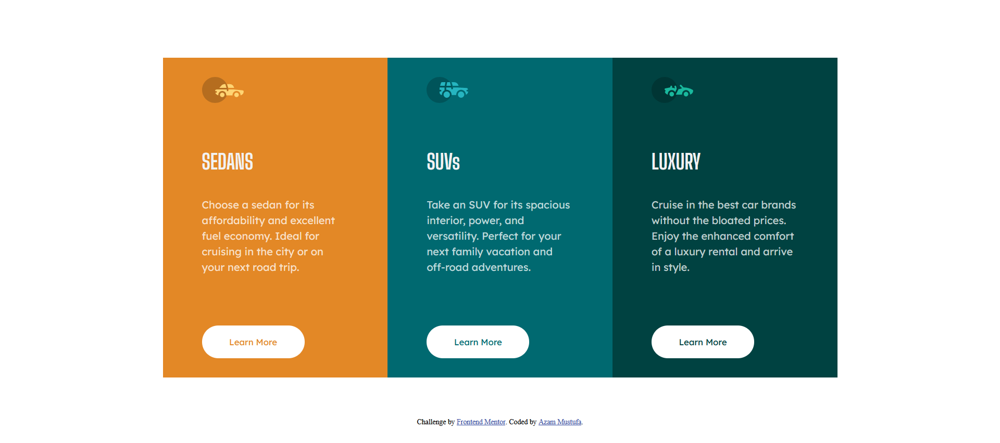

# This is a solution to the [3-column preview card component challenge on Frontend Mentor](https://www.frontendmentor.io/challenges/3column-preview-card-component-pH92eAR2-). Frontend Mentor challenges help you improve your coding skills by building realistic projects

    

## [Built with]

- Semantic HTML5 markup
- CSS custom properties
- CSS Grid

### Live Site URL: [Click Here](https://azammustafa66.github.io/3-column-preview-card-component-main/)
